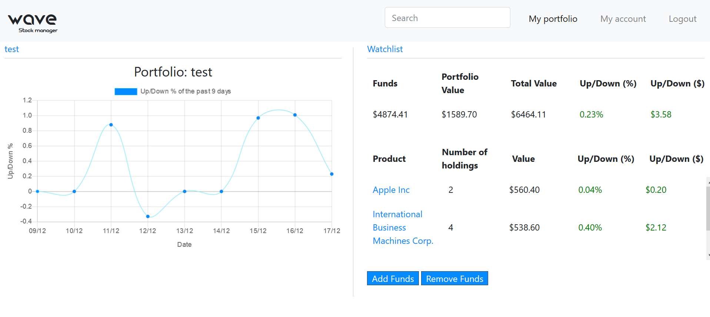

# Design

This is the design document for Wave Stock manager, the application is based on four different apps, namely: Home, User, Portfolio and Holding. This document aims at making clear what every part of the application is used for.

## URLs
The URLs are divided between the different apps, not all URLs are included as some will speak for itself.

### Home
Includes the most prominent urls for the home app.

#### " /"
Renders the homepage. This page contains a link to the login and registration page. This is the only page that is able to scroll downwards. The page contains several keyframe animations and general information to try persuade people to use the application.
 <!-- .element height="50%" width="50%" -->

#### login/
Renders the loginpage. This page contains a link to the registration page as seen below. Also when a user successfully logs in it will redirect to the portfolio url.
 <!-- .element height="50%" width="50%" -->

#### register/
Renders the registration page, a successful registration will redirect the login page as seen above.
 <!-- .element height="50%" width="50%" -->

### User
Includes the most prominent urls for the User app.

#### portfolio/
Renders the portfolio page. Only accessible when user is logged in.
 <!-- .element height="50%" width="50%" -->

#### Background Update and update_portfolio_report function
This is probably the core of the application, this background tasks will routinely update all the data in the databases which means it is linked to the Intrinio API to receive exchange data. It will automatically update all the values of all the securities, update the values in the portfolios and watchlists of every user and also sends emails when alert is triggered. It will repeat the cycle every 60 seconds keeping data almost realtime.
The update_portfolio_report function only runs once a day and updates the daily profit/loss percentages of each portfolio.

### Portfolio
Includes the most prominent urls for the Portfolio app.

#### AddPortfolio/
In this function a user can create a new portfolio with it's own name and starting balance. Once its made the user can add all the stocks he/she wants or add and remove funds.

#### Search/
The search bar located in the navbar can be used to find securities/stocks. The search bar is equipped with a datalist so it will give suggestions as to what the correct search terms are. Once selected the user must press enter to search. Any other search queries will not be accepted. The search query or ticker of the stock/security will be redirected to the Security url which will render the security page.

#### Security/<str:ticker>/
This page is rendered after the user searches or links to a specific security. It will display a graph of the current values and also buttons where the user can do a few things: buy securities, sell securities, add the security to the watchlist or set up an alert.
 <!-- .element height="50%" width="50%" -->
 <!-- .element height="50%" width="50%" -->
 <!-- .element height="50%" width="50%" -->

#### watchlist/
The user has a watchlist to which they can add or remove securities, this url will render the watchlist page. Where on the left the portfolio is still visible and on the right the watchlist.
 <!-- .element height="50%" width="50%" -->

#### Account/
The user has an account page and can reach this by clicking on the my account link. The url renders the account page on which the user can do a few things, change their contact email, delete their account and remove alerts.
 <!-- .element height="50%" width="50%" -->

### Holding
Includes the most prominent urls for the Portfolio app.

#### Buy/
Once the user buys a security the transaction and portfolio will be updated here.

#### Sell/
Once the user sells a security the transaction and portfolio will be updated here.

#### AddReminder/
This function will add an alert to a users alert list.

#### RemoveAlert/<str:name>/
This function will remove an alert to a users alert list.

#### AddWatch/<str:ticker>/
This function will add a security to a users watch list.

#### RemoveWatch/<str:ticker>/
This function will remove a security to a users watch list.
