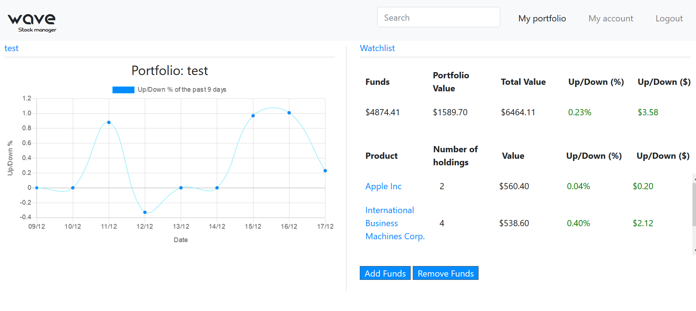
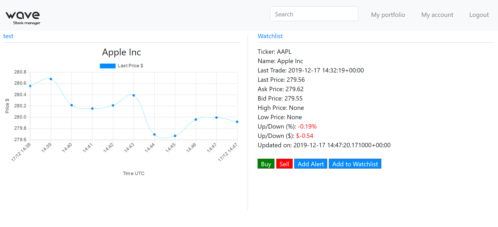

# Wave Stock manager

## Application purpose
The main aim of the application is to assist people with managing their stocks and portfolio. The users can update their portfolio and set alerts for certain securities that will notify them when a stock has risen or dropped by a certain amount which is a function that is not commonly found on brokerage websites. This feature could be handy for the high frequency trader.

### Main Features
A short list of the websites most prominent features:
* User is able to create ones own portfolio
* User is able to keep track of the profits or loses of their portfolio over the past 9 days
* User is able to buy and sell stocks for whatever price they want
* Ability of adding stocks to watchlist containing stocks one might want to purchase
* Ability to set a reminder that emails a user when stocks increase or decrease by certain amount, user can choose between % and USD.

## Final Product
The user is able to make use of all the elements noted in chapter: main features. This includes: creating ones own portfolio, user has access to realtime data from the stock exchange this makes use of the sandbox Intrinio API. The user has access to 28 different securities on the exchange. The 28 is easily extended by stepping away from the sandbox API and won't require any significant structural changes. The user can buy or sell securities which automatically updates the portfolio. The user has also got access to a watchlist in which you can store securities that you don't have in your portfolio. In addition to this the user can also set up an alert for a specific security, the user can set the alert for when a security goes above or below a certain threshold (in both % or in $). All the databases are also being live updated using background tasks. A picture of the most important pages can be found below.

The portfolio layout of the application.
 <!-- .element height="50%" width="50%" -->

The individual security layout of the application.
 <!-- .element height="50%" width="50%" -->

## Screencast
The screencast can be found at the following link:
[Screencast of Wave stock manager](https://youtu.be/OvoYzAJ1K74  "Screencast Wave")

## Notes
This website makes use of django back ground tasks to keep all the models up to date with the current prices and also is used for checking alert triggers and other such elements. The website will not function without the background tasks being set up correctly. Follow the steps to set up the background tasks:
* run python manage.py process_tasks in a separate terminal
* in portfolio_view look for the background tasks code that has been commented out and leave the comment # so its a function
* run the server and navigate to the portfolio page
* check the process_tasks, (they should be updating things now)
* in portfolio_view comment the function out again to prevent the tasks from piling up.
* background tasks should now be up and running, leave this running while using the website.

This website makes use of a lot of models and variables, variables names are often abbreviated. If one of the following letters seem out of place refer to this list:
* p - portfolio
* h - holding
* pp - portfolio percentage
* pv/pvalue - portfolio value
* hp - holding percentage
* hv - holding value
* Updown - refers to fluctuation in percentage or values
* starting with a W - items in a watchlist
* valuep - value of previous trading day

## License
Copyright 2019 Loek van Steijn All Rights Reserved

## Acknowledgements
MIT for creating charts.js which allowed for the intraday data to be nicely plotted.
Intrinio for allowing users to use their API
Nugoho for creating an awesome font
